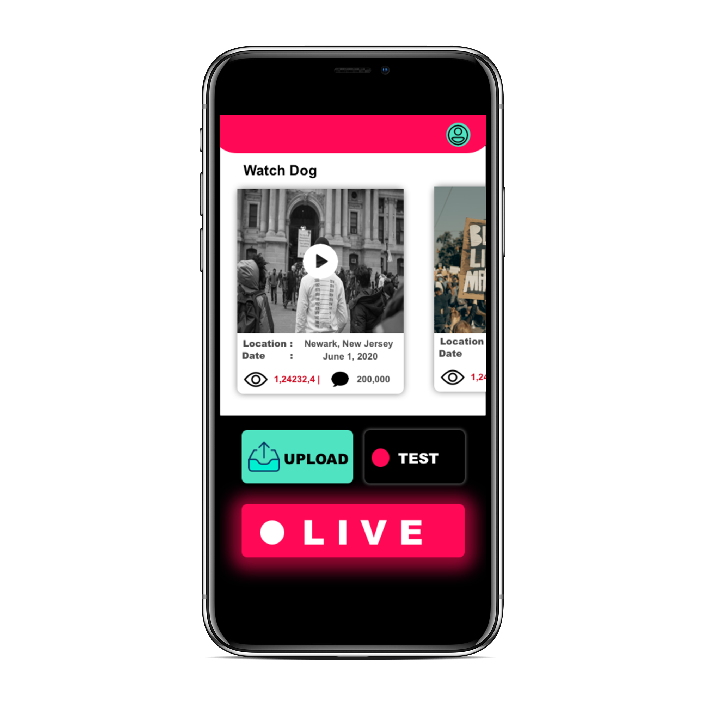
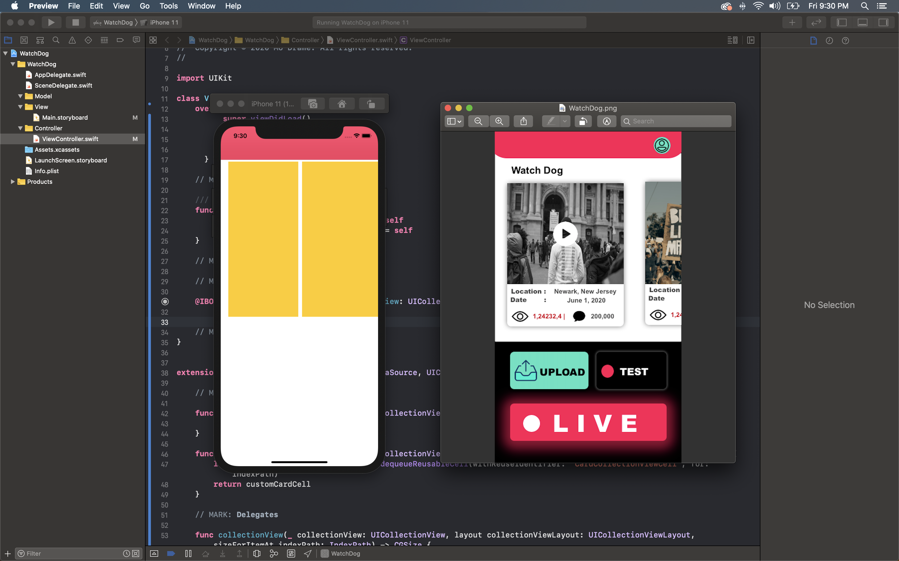
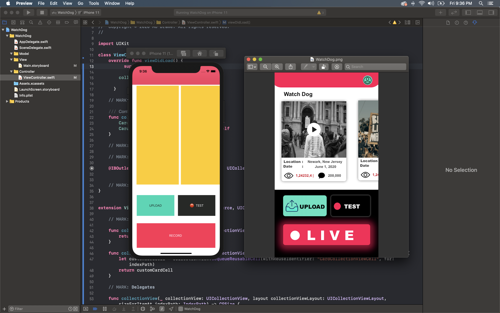
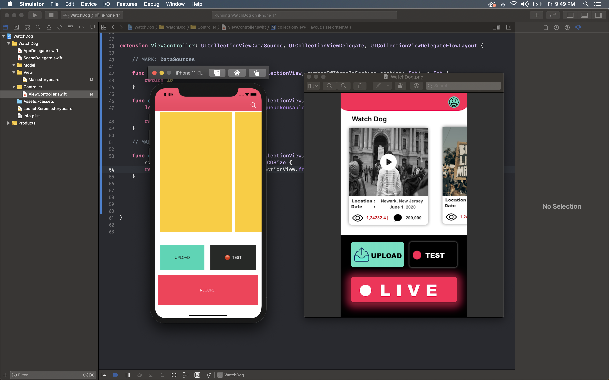
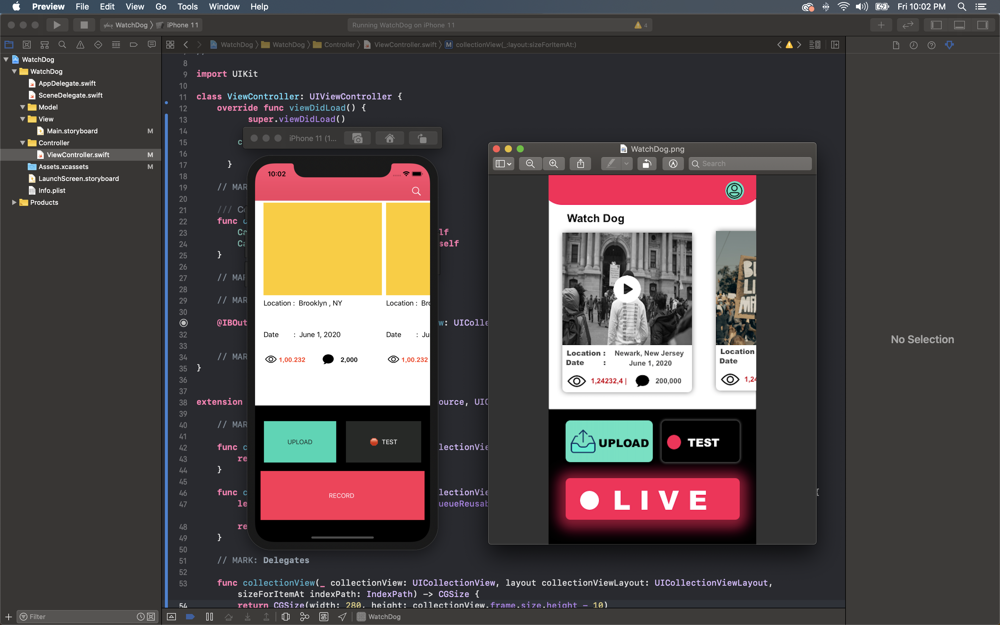

<h1 align="center">
   
  
   
  Microsoft Summer Challange Programe 
   
</h1>
<h1 align="center">
  W A T C H  -  D O G   👁‍🗨
   
</h1>

<h4 align="center">Watch Dog is a mobile app platform to help fight police brutality, and social injustice against minority through means of video recording..</h4>

### StoryBoard Development TimeStamp

   

### Technology :

* Swift 
* Cocoapod 
* C R U D : ( FireBase Storage for images & FireBase Data Base for User profile)
* Auth : Firebase Auth
* Live feature : Third party library 

### Build Technique:

* Skalenton StoryBoard

